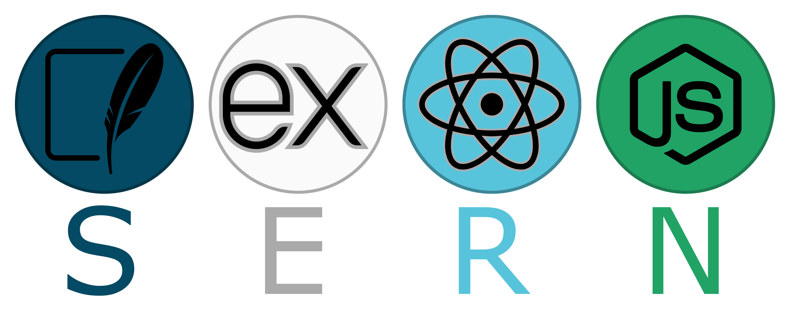

# SERN WebApp

  

This tutorial introduces the SERN stack. My goal is to set up a development environment and build a web application that can:

- Display dynamic data fetched from an API
- Provide an API to manage data in a database
- Allow users to add, edit, and delete data from the webpage
- Feature a minimalistic design
- Include a chat WebSocket endpoint that simply echoes messages

I'm not an expert in this field. I recently learned how to set up and use this stack from scratch. Previously, I built a web app using only Node.js with vanilla JavaScript and manual CSS.

To better understand the differences, I'll create this web app twice:

1. Once with the full SERN stack
2. Once using only SQLite and Node.js (SN)

Then, I'll compare the two approaches.
